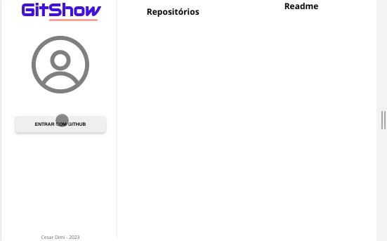

# GitShow

<p>This project was created using Next.js and NextAuth. It's set up to do social login with GitHub through NextAuth and check out your public repositories in a cool and simplified way.</p>

## preview


## features
- [x] Accessing the GitHub API.
- [x] Social login with NextAuth.
- [x] Rendering Markdown files.

<br>

## [>>  DEPLOY  <<](https://cesardmn.github.io/gitshow)

<br>

## cloning and running 

- require NodeJs v16.+

clone and intstall:
```bash
$ git clone https://github.com/cesardmn/gitshow.git
$ cd gitshow
$ npm i
```

run:
```bash
$ npm run dev
```

<br>
<br>

## Developed by Cesar Dimi.
[](https://www.linkedin.com/in/cesardmn/)
[](https://wa.me/5521982399315)

<br>
<br>

